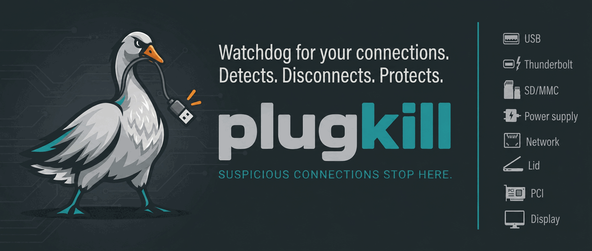
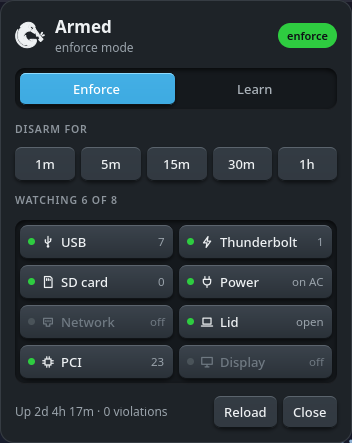
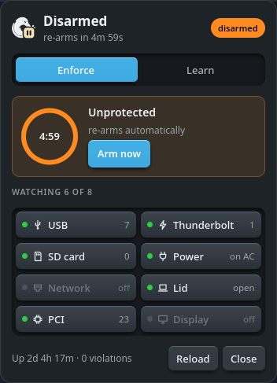
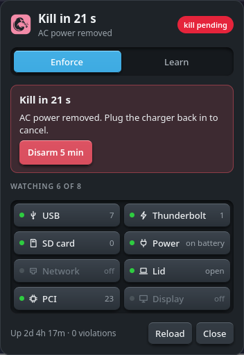
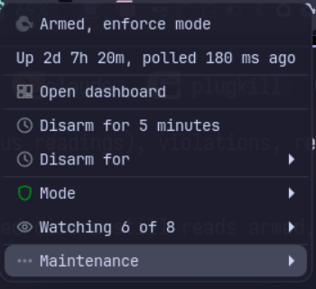
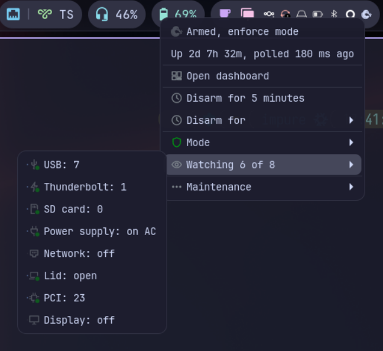

A hardware kill-switch daemon for Linux and FreeBSD. It watches the physical state of the machine and powers it off when something changes that you did not authorize: a USB stick appears, the Thunderbolt bus grows a device, the power cable is pulled, the Ethernet cable is unplugged, the lid closes, a monitor is attached.

Before it shuts down it can shred files, run your own commands, wipe swap and delete its own binary.

## What it watches

Each bus can be turned off in the config (`watch_usb = false`) or on the command line (`--no-usb`).

| Bus | Where it reads | Whitelist key | Config section |
|-----|----------------|---------------|----------------|
| USB | `/sys/bus/usb/devices` | `vendor_id` + `product_id`, with a count | `[whitelist]` |
| Thunderbolt/USB4 | `/sys/bus/thunderbolt/devices` | `unique_id` (UUID) | `[thunderbolt_whitelist]` |
| SD/MMC/SDIO | `/sys/bus/mmc/devices` | `serial` (hex) | `[sdcard_whitelist]` |
| Power supply | `/sys/class/power_supply` | none, policy based | `[power]` |
| Network | `/sys/class/net` | none, interface filter | `[network]` |
| Lid | D-Bus logind, `/proc/acpi` fallback | none, policy based | `[lid]` |
| PCI | `/sys/bus/pci/devices` | none, ignore list | `[pci]` |
| Display | `/sys/class/drm` | none, ignore list | `[display]` |

Power, network and lid monitoring are off by default. The PCI monitor is worth enabling on machines with Thunderbolt: a TB device that tunnels PCIe shows up as a new PCI device, so PCI catches it even where per-device whitelisting is not available.

## Quick start

```bash
git clone https://github.com/AcidDemon/plugkill.git
cd plugkill
cargo build --release
sudo install -m 755 target/release/plugkill /usr/local/bin/
```

Find out what is currently plugged in. Neither command needs root:

```bash
plugkill --list-devices          # USB, Thunderbolt and SD devices with details
plugkill --generate-whitelist    # the same devices as TOML you can paste into the config
```

Write a config and paste the whitelist into it:

```bash
sudo mkdir -p /etc/plugkill /var/log/plugkill /run/plugkill
plugkill --default-config | sudo tee /etc/plugkill/config.toml > /dev/null
sudo chmod 600 /etc/plugkill/config.toml
```

Review `[destruction]` and `[commands]` before going any further, then try it without the consequences:

```bash
sudo plugkill --dry-run     # logs what it would do, shreds nothing, shuts nothing down
```

Plug or unplug something to see it trigger. Once the whitelist looks right, learning mode runs the real daemon but never fires the kill sequence, which is the safer way to validate a whitelist in production:

```bash
sudo plugkill --learn-mode
```

Then run it for real with `sudo plugkill`, or under systemd (see below).

## Runtime control

The daemon listens on a Unix socket at `/run/plugkill/plugkill.sock`, and the same binary talks to it:

```bash
sudo plugkill --status              # human-readable: armed, mode, uptime, device counts, etc.
sudo plugkill --status --json       # the same status as JSON
sudo plugkill --disarm 300          # disarm for 5 minutes
sudo plugkill --arm                 # re-arm now, re-capturing baselines
sudo plugkill --learn               # switch to learning mode
sudo plugkill --enforce             # switch back
sudo plugkill --reload              # reload the config without restarting
```

There is no indefinite disarm. A timeout is mandatory and the maximum is 3600 seconds. When the timeout expires, or when you re-arm by hand, plugkill re-captures its baselines from whatever is connected at that moment.

The protocol is line-delimited JSON, so scripting it directly works too:

```bash
echo '{"command":"status"}' | sudo socat - UNIX-CONNECT:/run/plugkill/plugkill.sock
```

`kill`, the command the relay sends, is the one command the daemon restricts by caller. It reads the peer's uid off the socket and refuses `kill` unless it is 0, so only root can fire the kill sequence this way. Every other command stays reachable to any user who can open the socket, which is how members of the socket group use the GUI and CLI, unless `require_auth` is on: see Asking for a password first below.

### Runtime allowances

An allowance lets one device through without disarming anything. Disarm switches every bus off at once and re-captures baselines when it ends, so whatever was plugged in during the window becomes accepted state for good, and nothing records that it happened. An allowance is narrower on every axis: one device, listed in `--status`, and revocable.

There are three ways to make one. `--pair` and `--allow-last` at runtime, and the config whitelist for a device you want back after a reboot.

```bash
sudo plugkill --pair                # admit the next new device, 60 second window
sudo plugkill --pair 300            # a longer window, up to 3600 seconds
sudo plugkill --allow-last          # allow the device that caused the last violation
```

`--pair` closes on the first device it admits or when the window runs out, whichever comes first, so one window admits one device and not everything plugged in during the next minute. A second `--pair` while a window is open moves the deadline instead of stacking, and `--pair 0` closes it. `--allow-last` is for a device that is already plugged in: you saw the violation go by, and now you want that one device allowed without retyping its IDs. Pass `--for <DURATION>` with either one for an allowance that expires on its own; without it, an allowance lasts until you revoke it or the daemon restarts.

```bash
sudo plugkill --allowances              # table of what is allowed right now
sudo plugkill --allowances --json       # the same as JSON
sudo plugkill --allowances --toml       # the same as config text to paste
sudo plugkill --revoke usb:1d6b:0002    # drop one
sudo plugkill --revoke-all              # drop all of them
```

Selectors are `<bus>:<identity>`, the way `--allowances` prints them: `usb:1d6b:0002`, `thunderbolt:<uuid>`, `sdcard:<serial>`, `pci:0000:01:00.0`, `display:SAM:772d:811021873`. Revocation takes effect on the next poll. An allowed device is kept out of the baseline while the allowance stands, which is what makes revoking mean anything: the device then reads as newly appeared rather than as something the daemon already accepted.

Allowances live in memory and are never written to disk. A restart or a reboot clears them, which is deliberate: a reboot is a clean slate, and there is no file for anyone to seed. To keep a device for good, put it in the config whitelist. `--allowances --toml` prints the TOML for that and `--allowances --nix` the NixOS form, both to paste yourself; neither writes anything, and on NixOS the config is a read-only store path in any case.

Allowances cover USB, Thunderbolt, SD card, PCI and display. Power, network and lid have none: those are events rather than devices, so there is nothing for an allowance to name, and a command naming one of them is refused. Disarm is still the tool there.

A display allowance follows the monitor, not the port. An allowed monitor moved to another connector stays allowed, and a different monitor on that connector is a violation, which is the swap allowing a port would have let through. Where the platform reports no connector data, which is FreeBSD, a display allowance is refused with an error saying so.

With `require_auth` on, `--pair` and `--allow-last` ask for a password, the same way disarm does. `--revoke` and `--revoke-all` never do: they only take an allowance away, and the safer direction must not be the harder one.

### Config reload behavior

`--reload` makes the daemon re-read the config file from the path it started with, re-check the file's ownership and permissions, and validate it. If any of those fail, the daemon logs the error and keeps running on the config it already has.

A reload applies:

- `general.sleep_ms`, from the next poll onward
- `general.log_file`, used by the next kill event
- The three whitelist sections, from the next poll onward
- The `watch_*` switches. A bus you turn off stops being checked and drops its baseline, and a bus you turn on gets a fresh baseline captured during the reload. If that capture fails, the daemon warns and leaves the bus unmonitored instead of exiting
- The `[power]`, `[network]`, `[lid]`, `[pci]` and `[display]` sections, from the next poll onward
- The `[destruction]` and `[commands]` sections, read when a kill fires

A reload does not:

- Re-capture baselines for buses that were already being watched. Use `--arm` for that
- Re-capture the baseline that `network.interfaces`, `pci.ignore` or `display.ignore` is compared against, so narrowing one of those filters can read as a device change on the next poll. Follow such a change with `--arm`
- Undo CLI flags. `--dry-run` and the `--no-*` flags keep overriding the file for the life of the process
- Acquire the logind sleep inhibitor. Lid monitoring switched on by a reload still sees the lid close, but plugkill only takes the inhibitor at startup, so restart the daemon if you need it to act before suspend
- Change the control socket path, which comes from `--socket` and has no config key

## Tray and dashboard

`plugkill-gui` is an optional tray icon. It talks to the control socket like the CLI does, and sends only commands any socket group member may send, so it never runs as root.

The icon is a goose that follows the panel's foreground colour, and its shape carries the state: plain while armed, with a ring badge in the corner while learning or in a dry run, with a pause badge while disarmed, a solid block that blinks while a kill counts down, and faded with a line through it when the daemon does not answer, or answers but has not polled for 30 seconds. The learning and disarm badges are drawn in the theme's warning colour, and a pending kill turns the whole icon into the theme's error colour.

Right click opens a menu. State and uptime at the top, then open dashboard, a one-click Disarm for 5 minutes, a Disarm for submenu with all the presets (1m, 5m, 15m, 30m, 1h), a Mode submenu with enforce and learn, a Watching submenu listing every bus with its current reading, the violation count, reload config and quit. While it is disarmed those two disarm entries become Arm now and Extend disarm.

Left click opens the dashboard, or closes it if it is already up. It repeats the state header, adds the enforce and learn switch, and below that shows one of four things. The disarm presets. A ring counting down to re-arming. The kill warning, which carries the reason, how to undo it, and a Disarm 5 min button that stops the countdown at once. Or a line saying why nothing is being checked, while the daemon is not reporting. Then the eight bus tiles, each with a lamp, green when the bus is watched and unlit when it is not, with the tile text greyed out to match. Hover a tile to see what that bus is watching right now. The footer carries uptime, the violation count, reload and close.

While the daemon is not reporting, the mode switch, the tiles and the footer are hidden, so a first launch before the daemon is up looks bare on purpose.

Left click, in three of its states:

| Armed | Disarmed | Kill pending |
|---|---|---|
|  |  |  |

Right click, closed and with the bus list open. The green dot marks a watched bus, so six of eight can be counted without reading a word:

| The menu | Watching |
|---|---|
|  |  |

On Hyprland with waybar, against the test daemon in `crates/plugkill-gui/examples/fake_daemon.rs`, which is why the uptime and the device counts are the same in each. The menu is drawn by the panel, so it takes the desktop's own theme, down to the transparency, and it opens the submenu on whichever side has room.

It needs GTK 4 and gtk4-layer-shell, and your user in the group that owns the control socket (see Installing below for how the group gets set). On NixOS that is `services.plugkill.socketGroup`, `plugkill` by default. Anywhere else you have to pass `--socket-group <group>` to the daemon yourself and put your user in that group, because plugkill leaves the socket root-only otherwise.

Building it needs the GTK 4 and gtk4-layer-shell development packages and pkg-config, not just the runtime libraries.

```bash
nix run github:AcidDemon/plugkill#gui
cargo build --release -p plugkill-gui     # anywhere else
```

The `-p` matters. plugkill-gui is not a workspace default member, so a plain `cargo build` skips it and the rest of the tree builds without GTK.

There is no desktop entry yet. Copy `target/release/plugkill-gui` somewhere on your path and start it from your session's autostart. It takes one optional argument, the control socket path, which you need if the daemon runs with a non-default `--socket`.

On Wayland compositors that implement wlr-layer-shell (Hyprland, Sway, KWin) the dashboard anchors next to the tray icon. On GNOME and on any X11 session it opens as an ordinary window, and the GNOME panel needs the AppIndicator extension before it shows tray icons at all.

### Asking for a password first

Group membership alone is the whole check, which does not help if the machine is unlocked and unattended: whoever sits down disarms it and walks off with it. `[general] require_auth = true` puts the commands that can stop a kill behind polkit, which asks the caller for their own password every time and caches nothing: disarm, learn and reload, and the two that let a device through, `--pair` and `--allow-last`. Arm, enforce and revoking an allowance only make the daemon stricter and stay open. On NixOS it is `services.plugkill.requireAuth`, which also needs `security.polkit.enable`.

Polkit has to know the actions before it can be asked about them, so a source install needs the action file as well. The Nix package installs it already:

```bash
sudo install -Dm444 assets/net.acidnetworks.plugkill.policy /usr/share/polkit-1/actions/net.acidnetworks.plugkill.policy
```

Without that file polkit has no such action and refuses every gated command outright, with no prompt at all.

It needs a polkit agent running in your session, the same one `pkexec` and GNOME or KDE settings use; the prompt comes from there, and the tray waits up to two minutes for you to answer it. That two-minute wait is how long the CLI and the tray give disarm, learn and reload whether or not `require_auth` is on: the client cannot know whether the daemon gates them, so it always allows for a prompt. With no agent to ask, the gated commands are refused. A caller with no session of its own, the tray and anything else the systemd user manager starts, is asked as the session you are sitting at, so the prompt appears on the local screen; a remote caller that leaves its ssh session, `systemd-run --user` for instance, takes that same path. A remote login that keeps its own session counts as inactive and is refused, as is a user with no display session at all. The tray and the dashboard then say so under the state, and the state stays what the daemon reports, so a refused disarm still reads armed, because it is. root is never asked, so `sudo plugkill --disarm` works on a headless machine with no session at all.

It is off by default, and it is not a lock on the hardware: someone who knows your password still gets in, and nothing stops them from pulling the plug, which is what the kill switch is for.

## Configuration

`plugkill --default-config` prints a commented starting point. The interesting parts:

```toml
[general]
sleep_ms = 250                                    # polling interval, 50-10000
log_file = "/var/log/plugkill/plugkill.log"
watch_usb = true
watch_thunderbolt = true
watch_sdcard = true
watch_power = false
watch_network = false
watch_lid = false
watch_pci = false
watch_display = false
require_auth = false                              # authenticate disarm, learn and reload

[whitelist]
devices = [
  { vendor_id = "1d6b", product_id = "0002", count = 3 },
]

[thunderbolt_whitelist]
devices = []                     # { unique_id = "xxxxxxxx-xxxx-xxxx-xxxx-xxxxxxxxxxxx" }

[sdcard_whitelist]
devices = []                     # { serial = "0x12345678" }

[power]
policy = "monitor"               # trigger-once, ac-required, monitor
grace_secs = 0                   # 0-300
require_locked = false           # only trigger while the session is locked

[network]
policy = "monitor"               # kill, monitor
grace_secs = 0
interfaces = ["eth0"]            # empty means all physical NICs

[lid]
policy = "monitor"               # kill, monitor
grace_secs = 0

[pci]
policy = "monitor"               # kill, monitor
ignore = []                      # selectors to ignore, e.g. "0000:01:00.0" ("pci0:1:0:0" on FreeBSD)

[display]
policy = "monitor"               # kill, monitor
ignore = []                      # connectors to ignore, e.g. "eDP" (no effect on FreeBSD)

[destruction]
files_to_remove = []             # shredded with a 3-pass random overwrite
folders_to_remove = []           # shredded recursively
melt_self = false                # delete the binary, the dir holding this config, and /var/log/plugkill
do_sync = true
do_wipe_swap = false
# swap_device = "/dev/sda2"      # required when do_wipe_swap = true

[commands]
kill_commands = []               # [["/usr/bin/truecrypt", "--dismount"]]
```

plugkill refuses to start on a config that fails any of these:

- owned by root
- not group- or world-writable
- every path absolute, with no `..` in it
- every kill command binary given by absolute path

## CLI

```
plugkill [OPTIONS]

Daemon:
  -c, --config <PATH>       Config file [default: /etc/plugkill/config.toml]
      --dry-run             Log actions instead of executing them
      --learn-mode          Start in learning mode
      --no-usb              Disable USB monitoring
      --no-thunderbolt      Disable Thunderbolt monitoring
      --no-sdcard           Disable SD card monitoring
      --no-power            Disable power supply monitoring
      --no-network          Disable network link monitoring
      --no-lid              Disable lid close monitoring
      --no-pci              Disable PCI bus monitoring
      --no-display          Disable external display monitoring
      --socket <PATH>       Control socket [default: /run/plugkill/plugkill.sock]
      --socket-group <NAME> Group name for socket ownership (non-root GUI access)

Client, against a running daemon:
      --status              Print daemon status
      --json                Print client responses as JSON instead of text
      --disarm <SECONDS>    Disarm for N seconds (1-3600)
      --arm                 Re-arm and re-capture baselines
      --learn               Switch to learning mode
      --enforce             Switch to enforce mode
      --reload              Reload the configuration
      --pair [SECONDS]      Admit the next new device (default 60, max 3600)
      --allow-last          Allow the device that caused the last violation
      --for <DURATION>      Expiry for --pair or --allow-last (default: none)
      --revoke <SELECTOR>   Revoke one allowance
      --revoke-all          Revoke every allowance
      --allowances          List active allowances

No root required:
      --default-config      Print the default configuration
      --list-devices        List connected devices with details
      --generate-whitelist  Generate whitelist TOML from connected devices

  -h, --help
  -V, --version
```

## Installing

### NixOS

```nix
{
  inputs.plugkill.url = "github:AcidDemon/plugkill";

  outputs = { self, nixpkgs, plugkill, ... }: {
    nixosConfigurations.myhost = nixpkgs.lib.nixosSystem {
      modules = [
        plugkill.nixosModules.default
        {
          services.plugkill = {
            enable = true;
            settings = {
              general.sleep_ms = 250;
              general.watch_power = true;
              general.watch_lid = true;
              whitelist.devices = [
                { vendor_id = "1d6b"; product_id = "0002"; count = 3; }
              ];
              power = {
                policy = "trigger-once";
                grace_secs = 30;
                require_locked = true;
              };
              lid = {
                policy = "kill";
                grace_secs = 5;
              };
              destruction.files_to_remove = [ "/home/user/secrets.tar.gpg" ];
            };
          };
        }
      ];
    };
  };
}
```

The module runs plugkill as a hardened systemd service: restricted capabilities, filesystem protections, no network beyond `AF_UNIX`, and a `RuntimeDirectory` for the control socket.

It always passes `--socket-group`, set from `services.plugkill.socketGroup` (default `plugkill`). plugkill then chowns the socket to that group and sets it mode 0660, so the group is the intended way to reach the socket without root. The module ships `/run/plugkill` at mode 0755, so group members can traverse it and connect. The socket's own 0660 mode and group ownership are what restrict access.

Under the module, `melt_self` removes only the contents of the log directory: plugkill refuses to remove the config directory because the module passes a `/nix/store` config path, and it cannot remove its own binary because that is a read-only store path too.

### systemd on other distributions

Build and install as in the quick start. If you want the tray, or any non-root client, to reach the control socket, create the group and add yourself to it first:

```bash
sudo groupadd -r plugkill
sudo usermod -aG plugkill "$USER"
```

If you are turning on `require_auth`, install the polkit action file too, or polkit refuses disarm, learn and reload with no prompt:

```bash
sudo install -Dm444 assets/net.acidnetworks.plugkill.policy /usr/share/polkit-1/actions/net.acidnetworks.plugkill.policy
```

Then create `/etc/systemd/system/plugkill.service`:

```ini
[Unit]
Description=plugkill hardware kill-switch daemon
After=multi-user.target

[Service]
Type=simple
ExecStart=/usr/local/bin/plugkill --config /etc/plugkill/config.toml --socket-group plugkill
Restart=on-failure
RestartSec=5
RuntimeDirectory=plugkill
RuntimeDirectoryMode=0755
Environment=RUST_LOG=info

ProtectSystem=strict
ReadWritePaths=/var/log/plugkill /run/plugkill
PrivateTmp=true
NoNewPrivileges=true
ProtectKernelTunables=true
ProtectKernelModules=true
ProtectControlGroups=true
RestrictAddressFamilies=AF_UNIX
MemoryDenyWriteExecute=true
UMask=0077

[Install]
WantedBy=multi-user.target
```

```bash
sudo systemctl daemon-reload
sudo systemctl enable --now plugkill.service
```

### FreeBSD

Same source tree. USB enumeration links against the libusb in the base system, and `pkgconf` lets the build find it, so the Rust toolchain is the only thing you need to install.

```sh
pkg install rust pkgconf

git clone https://github.com/AcidDemon/plugkill.git
cd plugkill
cargo build --release
install -m 755 target/release/plugkill /usr/local/bin/
install -m 755 target/release/plugkill-relay /usr/local/bin/   # optional

mkdir -p /usr/local/etc/plugkill /var/log/plugkill /var/run/plugkill
plugkill --default-config > /usr/local/etc/plugkill/config.toml
chmod 600 /usr/local/etc/plugkill/config.toml

install -m 755 freebsd/rc.d/plugkill /usr/local/etc/rc.d/plugkill
sysrc plugkill_enable=YES
service plugkill start
```

Test with `plugkill_flags="--dry-run"` in `/etc/rc.conf` first, or run `plugkill --dry-run` by hand. The relay has its own script at `freebsd/rc.d/plugkill-relay` with the `plugkill_relay_enable` knob.

Config lives in `/usr/local/etc/plugkill` and the control socket in `/var/run/plugkill`.

Lid monitoring needs the machine awake long enough for plugkill to see the close, so hand the event to plugkill instead of ACPI:

```sh
sysrc -f /etc/sysctl.conf hw.acpi.lid_switch_state=NONE
sysctl hw.acpi.lid_switch_state=NONE
```

Lid state comes from devd's event socket at `/var/run/devd.pipe`, and devd runs by default.

## How it works

At startup plugkill takes a baseline snapshot of every device on every active bus. Every 250 ms by default it polls again and compares against that baseline plus your whitelists. An unauthorized change fires the kill sequence: mask signals, shred the configured files, run the configured commands, sync, wipe swap, delete itself, power off. In learning mode the violation is logged and counted instead. Learn mode covers locally detected violations only: the daemon logs a signature-verified `kill` from a relay peer and then refuses it, and the relay answers a refusal by powering the machine off itself, so learn mode is not a safe audit mode for a node inside a relay mesh.

Once a bus has a baseline, plugkill treats USB, Thunderbolt or SD card enumeration failure as tampering; PCI enumeration failure only logs a warning. A baseline that fails to capture is a separate case: a USB failure at startup exits, while a USB failure on reload or re-arm, and a Thunderbolt, SD card or PCI failure on a bus that is present, log a warning and leave that bus unmonitored until the next re-baseline (`--arm`, disarm timeout expiry, or `--reload`) -- `--status` keeps reporting the bus as watched, because that field reads the config flag. Buses whose hardware is absent (no Thunderbolt controller, no MMC bus) are skipped with an info line naming the bus, not a warning: missing hardware is not a failure.

Power monitoring tracks AC and battery transitions, with a grace period and optional session lock detection through logind. Network monitoring watches operstate on physical NICs for link-down. Lid monitoring takes a sleep inhibitor so it has a window to act before the machine suspends.

## Platform support

| Platform | Architecture | Status |
|----------|--------------|--------|
| Linux | x86_64 | Supported |
| Linux | aarch64 | Supported |
| FreeBSD | x86_64 | Supported |

One codebase, hardware backend picked at compile time. Linux reads sysfs, asks logind about session lock and lid state, and shuts down through `reboot(2)`. FreeBSD reads USB through libusb, AC through `hw.acpi.acline`, link state through the `SIOCGIFMEDIA` ioctl, PCI through `pciconf -l`, lid and display through devd events, and shuts down through `reboot(RB_POWEROFF)`.

Three things are missing on FreeBSD. Thunderbolt monitoring is unavailable, because there is no per-device `unique_id` to enumerate; the bus reports nothing, warns once, and `watch_thunderbolt` does nothing. `require_locked` depends on logind, so lock state always reads as unknown. And display monitoring has no connector identity: FreeBSD reports DRM hotplug through devd without naming the connector, so plugkill can tell that the display topology changed but not which connector moved or which monitor is attached.

plugkill does not talk to polkit on FreeBSD, whatever the ports tree has installed: the authorization check is compiled Linux-only, and the FreeBSD peer-credentials sockopt carries no pid to identify the caller with. So with `require_auth` on, every non-root disarm, learn, reload and allowance is refused there. That is the documented fallback rather than a bug. Run those as root on FreeBSD, or leave `require_auth` off.

Two display caveats there as well: the connector `ignore` list has no effect, since the devd event does not name the connector and any connector change trips, and HDMI hotplug has historically been less reliable than DisplayPort under drm-kmod.

SD card serials on FreeBSD are best-effort, read from `dev.mmcsd.N.%pnpinfo`. Check that your card's serial actually appears in `plugkill --list-devices` before you rely on `[sdcard_whitelist]`.

## Origin

A from-scratch Rust rewrite of [usbkill](https://github.com/hephaest0s/usbkill) by [Hephaestos](https://github.com/hephaest0s), with Thunderbolt and SD card monitoring, runtime control, learning mode and config hot-reload added.

## License

GPL-3.0. See [LICENSE](LICENSE).
